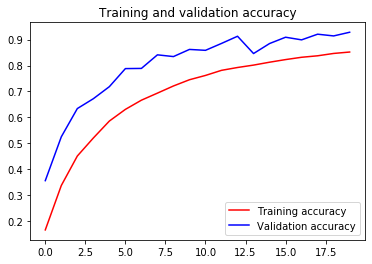
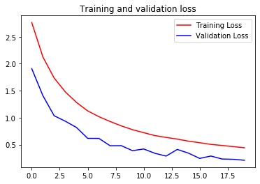

```python
# ATTENTION: Please do not alter any of the provided code in the exercise. Only add your own code where indicated
# ATTENTION: Please do not add or remove any cells in the exercise. The grader will check specific cells based on the cell position.
# ATTENTION: Please use the provided epoch values when training.

import csv
import numpy as np
import tensorflow as tf
from tensorflow.keras.preprocessing.image import ImageDataGenerator
from os import getcwd
```


```python
def get_data(filename):
  # You will need to write code that will read the file passed
  # into this function. The first line contains the column headers
  # so you should ignore it
  # Each successive line contians 785 comma separated values between 0 and 255
  # The first value is the label
  # The rest are the pixel values for that picture
  # The function will return 2 np.array types. One with all the labels
  # One with all the images
  #
  # Tips: 
  # If you read a full line (as 'row') then row[0] has the label
  # and row[1:785] has the 784 pixel values
  # Take a look at np.array_split to turn the 784 pixels into 28x28
  # You are reading in strings, but need the values to be floats
  # Check out np.array().astype for a conversion
    with open(filename) as training_file:
        reader = csv.reader(training_file, delimiter=',')    
        imgs = []
        labels = []

        next(reader, None)
        
        for row in reader:
            label = row[0]
            data = row[1:]
            img = np.array(data).reshape((28, 28))

            imgs.append(img)
            labels.append(label)

        images = np.array(imgs).astype(float)
        labels = np.array(labels).astype(float)
            
    return images, labels

path_sign_mnist_train = f"{getcwd()}/../tmp2/sign_mnist_train.csv"
path_sign_mnist_test = f"{getcwd()}/../tmp2/sign_mnist_test.csv"
training_images, training_labels = get_data(path_sign_mnist_train)
testing_images, testing_labels = get_data(path_sign_mnist_test)

# Keep these
print(training_images.shape)
print(training_labels.shape)
print(testing_images.shape)
print(testing_labels.shape)

# Their output should be:
# (27455, 28, 28)
# (27455,)
# (7172, 28, 28)
# (7172,)
```

    (27455, 28, 28)
    (27455,)
    (7172, 28, 28)
    (7172,)


```python
# In this section you will have to add another dimension to the data
# So, for example, if your array is (10000, 28, 28)
# You will need to make it (10000, 28, 28, 1)
# Hint: np.expand_dims

training_images = np.expand_dims(training_images,axis=3)
testing_images = np.expand_dims(testing_images,axis=3)

# Create an ImageDataGenerator and do Image Augmentation
train_datagen = ImageDataGenerator(rescale=1.0/255,
                                   rotation_range=40,
                                   width_shift_range=0.2,
                                   height_shift_range=0.2,
                                   shear_range=0.2,
                                   zoom_range=0.2,
                                   horizontal_flip=True,
                                   fill_mode='nearest'
    )

validation_datagen = ImageDataGenerator(rescale=1.0/255)
    
# Keep These
print(training_images.shape)
print(testing_images.shape)
    
# Their output should be:
# (27455, 28, 28, 1)
# (7172, 28, 28, 1)
```

    (27455, 28, 28, 1)
    (7172, 28, 28, 1)


```python
# Define the model
# Use no more than 2 Conv2D and 2 MaxPooling2D
model = tf.keras.models.Sequential([
    tf.keras.layers.Conv2D(16,(3,3),activation='relu',input_shape=(28,28,1)),
    tf.keras.layers.MaxPooling2D(2,2),
    tf.keras.layers.Conv2D(32,(3,3),activation='relu'),
    tf.keras.layers.MaxPooling2D(2,2),
    tf.keras.layers.Flatten(),
    tf.keras.layers.Dense(512,activation='relu'),
    tf.keras.layers.Dense(26,activation='softmax')
])

# Compile Model. 
model.compile(loss='sparse_categorical_crossentropy',optimizer='adam',metrics=['acc'])

train_gen = train_datagen.flow(
    training_images,
    training_labels,
    batch_size=64
)

val_gen = validation_datagen.flow(
    testing_images,
    testing_labels,
    batch_size=64
)

# Train the Model
history = model.fit_generator(
    train_gen,
    epochs=20,
    validation_data=val_gen
)

model.evaluate(testing_images, testing_labels, verbose=0)
```

    Epoch 1/20
    429/429 [==============================] - 40s 93ms/step - loss: 2.7638 - acc: 0.1650 - val_loss: 1.9082 - val_acc: 0.3553
    Epoch 2/20
    429/429 [==============================] - 34s 79ms/step - loss: 2.1232 - acc: 0.3366 - val_loss: 1.4057 - val_acc: 0.5247
    Epoch 3/20
    429/429 [==============================] - 33s 78ms/step - loss: 1.7345 - acc: 0.4504 - val_loss: 1.0357 - val_acc: 0.6337
    Epoch 4/20
    429/429 [==============================] - 33s 77ms/step - loss: 1.4772 - acc: 0.5200 - val_loss: 0.9338 - val_acc: 0.6718
    Epoch 5/20
    429/429 [==============================] - 35s 81ms/step - loss: 1.2810 - acc: 0.5855 - val_loss: 0.8174 - val_acc: 0.7183
    Epoch 6/20
    429/429 [==============================] - 33s 77ms/step - loss: 1.1250 - acc: 0.6306 - val_loss: 0.6159 - val_acc: 0.7881
    Epoch 7/20
    429/429 [==============================] - 33s 77ms/step - loss: 1.0176 - acc: 0.6661 - val_loss: 0.6152 - val_acc: 0.7888
    Epoch 8/20
    429/429 [==============================] - 33s 78ms/step - loss: 0.9286 - acc: 0.6933 - val_loss: 0.4793 - val_acc: 0.8412
    Epoch 9/20
    429/429 [==============================] - 34s 79ms/step - loss: 0.8472 - acc: 0.7210 - val_loss: 0.4805 - val_acc: 0.8345
    Epoch 10/20
    429/429 [==============================] - 34s 79ms/step - loss: 0.7771 - acc: 0.7450 - val_loss: 0.3878 - val_acc: 0.8621
    Epoch 11/20
    429/429 [==============================] - 33s 78ms/step - loss: 0.7217 - acc: 0.7616 - val_loss: 0.4191 - val_acc: 0.8586
    Epoch 12/20
    429/429 [==============================] - 35s 82ms/step - loss: 0.6675 - acc: 0.7814 - val_loss: 0.3392 - val_acc: 0.8852
    Epoch 13/20
    429/429 [==============================] - 35s 81ms/step - loss: 0.6335 - acc: 0.7923 - val_loss: 0.2876 - val_acc: 0.9130
    Epoch 14/20
    429/429 [==============================] - 35s 82ms/step - loss: 0.6020 - acc: 0.8016 - val_loss: 0.4104 - val_acc: 0.8462
    Epoch 15/20
    429/429 [==============================] - 34s 78ms/step - loss: 0.5645 - acc: 0.8127 - val_loss: 0.3420 - val_acc: 0.8848
    Epoch 16/20
    429/429 [==============================] - 34s 78ms/step - loss: 0.5354 - acc: 0.8229 - val_loss: 0.2446 - val_acc: 0.9092
    Epoch 17/20
    429/429 [==============================] - 35s 81ms/step - loss: 0.5046 - acc: 0.8318 - val_loss: 0.2884 - val_acc: 0.8991
    Epoch 18/20
    429/429 [==============================] - 36s 83ms/step - loss: 0.4844 - acc: 0.8375 - val_loss: 0.2332 - val_acc: 0.9209
    Epoch 19/20
    429/429 [==============================] - 33s 78ms/step - loss: 0.4630 - acc: 0.8466 - val_loss: 0.2280 - val_acc: 0.9142
    Epoch 20/20
    429/429 [==============================] - 36s 83ms/step - loss: 0.4419 - acc: 0.8520 - val_loss: 0.2105 - val_acc: 0.9285


    [170.26125113151622, 0.6738706]


```python
# Plot the chart for accuracy and loss on both training and validation
%matplotlib inline
import matplotlib.pyplot as plt
acc = history.history['acc']
val_acc = history.history['val_acc']
loss = history.history['loss']
val_loss = history.history['val_loss']

epochs = range(len(acc))

plt.plot(epochs, acc, 'r', label='Training accuracy')
plt.plot(epochs, val_acc, 'b', label='Validation accuracy')
plt.title('Training and validation accuracy')
plt.legend()
plt.figure()

plt.plot(epochs, loss, 'r', label='Training Loss')
plt.plot(epochs, val_loss, 'b', label='Validation Loss')
plt.title('Training and validation loss')
plt.legend()

plt.show()
```








# Submission Instructions


```python
# Now click the 'Submit Assignment' button above.
```

# When you're done or would like to take a break, please run the two cells below to save your work and close the Notebook. This will free up resources for your fellow learners. 


```javascript
%%javascript
<!-- Save the notebook -->
IPython.notebook.save_checkpoint();
```


```javascript
%%javascript
IPython.notebook.session.delete();
window.onbeforeunload = null
setTimeout(function() { window.close(); }, 1000);
```
